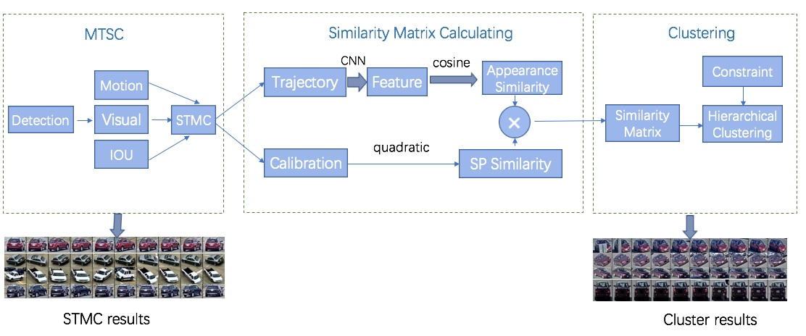

# Multi-Camera Vehicle Tracking with Powerful Visual Features and Spatial-Temporal Cue
This repository contains our source code of Track1 and Track2 in the NVIDIA AI City Challenge at CVPR 2019 Workshop.

## Authors
- [Zhiqun He]
- [Yu Lei]
- [Shuai Bai]
- [Wei Wu]

### Introduction
Detailed information of NVIDIA AICity Challenge 2019 can be found [here](https://www.aicitychallenge.org/).

The overall design of our algorithm, which consists of MTSC module, similarity matrix calculating module and clustering module.

### Citation
